# pdfAnnotate

*pdfAnnotate* allows to annotate PDF documents in javascript. It works in a browser, as well as, in a nodejs environment. The idea is to provide a simple interface to annotate PDF documents. The annotated PDF document can be easily downloaded or further processed.

**Note:** pdAnnotate is **no** PDF viewer/ renderer. It provides an API to create different types of PDF annotations. For implementing a web-based PDF editor we recommend to use it in combination with *PDF.js* or a similar renderer.

# Table of Contents

1. [Documentation](#Documentation)
    1. [Installation](#Installation)
    2. [Getting Started](#GettingStarted)
    3. [Demo / Examples](#Examples)
        1. [The Translation of Coordinates](#TranslationCoordinates)
        2. [Quadpoints](#QuadPoints)
    4. [API Documentation](#API)
        1. [Configuration Options](#configurationOptions)
        2. [Backward Compatibility](#backwardCompatibility)
        3. [Appearance Stream Support](#appearanceStreamSupport)
        4. [constructor(...)](#constructor)
        5. [loadFile(...)](#loadfile)
        6. [createTextAnnotation(...)](#createtext)
        7. [createHighlightAnnotation(...)](#createhighlight)
        8. [createUnderlineAnnotation(...)](#createunderline)
        9. [createSquigglyAnnotation(...)](#createsquiggly)
        10. [createStrikeOutAnnotation(...)](#createstrikeout)
        11. [createFreeTextAnnotation(...)](#createfreetext)
        12. [createLineAnnotation(...)](#createline)
        13. [createCircleAnnotation(...)](#createcircle)
        14. [createSquareAnnotation(...)](#createsquare)
        15. [createPolygonAnnotation(...)](#createpolygon)
        16. [createPolyLineAnnotation(...)](#createpolyline)
        17. [createStampAnnotation(...)](#createstamp)
        18. [createCaretAnnotation(...)](#createcaret)
        19. [createInkAnnotation(...)](#createink)
        20. [createPopupAnnotation(...)](#createpopup)
        21. [deleteAnnotation(...)](#deleteAnnotation)
        22. [getAnnotations()](#getAnnotations)
        23. [getFonts()](#getFonts)
        24. [write(...)](#write)
        25. [download(...)](#download)
        26. [save(...)](#save)
    5. [How does the Library Works?](#HowWorks)
        1. [Trivia](#Trivia)
        2. [Adding an Annotation](#AddingAnnotation)
        3. [Document Updates](#DocumentUpdates)
        4. [PDF Objects](#PDFObjects)
        5. [Cross-Reference Stream Objects](#CrossReferenceStreamObjects)
        6. [Stream Objects](#StreamObjects)
        7. [Compression](#Compression)

# <a name="Documentation"></a>Documentation

## <a name="Installation"></a>Installation

Either use npm for the installation or reference the bundled file from the *_bundles* directory.

```
npm install annotpdf
```

## <a name="GettingStarted"></a>Getting Started

If you use *Typescript* you can import the factory with:

```
import {AnnotationFactory} from 'annotpdf';
```

You can also load the bundled files from the *_bundles* directory.

To add annotations the *AnnotationFactory* needs to be initialized. One approach is to use the static *loadFile* method that takes as argument a filepath and then initializes the factory with the corresponding PDF document data.

Annotations can be easily created by calling `creator` methods (see [API Documentation](#API)). Finally the extended document can be downloaded by calling the *download* method.

```
AnnotationFactory.loadFile(path).then((factory) => {
                        factory.createTextAnnotation({
                                page: 0,
                                rect: [50, 50, 80, 80],
                                contents: "Pop up note",
                                author: "Max"
                                ...
                        })
                        factory.download()
})
```
When using a PDF viewer, as for instance *PDF.js* the factory can be initialized as follows:
```
pdfDocument.getData().then( (data) => {
                let pdfFactory = new AnnotationFactory(data)
                })
```

Thereby *pdfDocument* is the PDF document representation of the PDFjs library as provided by `pdfjsLib.getDocument(...)`. See the [examples](#Examples) for more information.

### <a name="UseInAngular"></a> Using the Library in Angular

If you use the library in Angular (9) just import the `AnnotationFactory` class as described above.

Then add the following to the `package.json` file of your angular project:
```
{
...
        "browser": {
                "fs": false
        }
...
}
```

## <a name="Examples"></a>Demo / Examples

An example application that uses the *pdfAnnotate* library together with *PDFjs* is given in the examples directory: **pdfjsExample.html**. By reading the code you might understand how to utilize the library and get some ideas how to combine it with the *PDFViewer*.

Although it is part of the code, we want to discuss the solution of a common problem when using PDFjs together with annotation libraries:

### <a name="TranslationCoordinates"></a>The Translation of Coordinates

When adding an annotation to a PDF most of the time the position of the annotation is determined by a mouse click. Depending on the object to which the click event handler is attached to the position coordinates are shifted by an offset or the PDF document is scaled.

Therefore we start by subtracting the offsets from the coordinates. This must be done with respect to the current page. Positioning of objects in PDF document is always based on the coordinate system of a page. A page spans a canvas on which multiple objects of different types are placed.

Finally we need to consider the viewport of the PDF representation. The PDF might be scaled. This must be considered when computing the coordinates.

The following code shows an examplary code snippet to translate the coordinates:

```
pdfContainer.addEventListener('click', (evt) => {
                let x = evt.pageX - $('#page' + pdfViewer.currentPageNumber).offset().left
                let y = evt.pageY - $('#page' + pdfViewer.currentPageNumber).offset().top

                x, y = pdfViewer._pages[pdfViewer.currentPageNumber - 1].viewport.convertToPdfPoint(x, y)
                })
```
**Note** that we assumed that you used the PDFjs *PDFViewer* for displaying the PDF and we utilized *JQuery* for the offset computation.

### <a name="QuadPoints"></a>Quadpoints

Quadpoints are a feature of PDF annotations to describe mulitple rectangles, where every rectangle is defined by four points given in *x* any *y* coordinates. The order of the points can be observed in the following depiction:


Please note the order. The PDF specification defines another order, but it seems to be an error (cfg. [Stackoverflow discussion](https://stackoverflow.com/questions/9855814/pdf-spec-vs-acrobat-creation-quadpoints) ) in the document.

It is possible to define multiple rectangles in a quadpoint array. The length of the quadpoints array must be a multiple of *8*. In some cases the API does not require the definition of quadpoints, although the definiton is actually required by the PDF specification. In these cases we derive the quadpoints directly from the provided rect array. However, it is always possible to overwrite this behaviour by providing the quadpoint array.

Please note that the coordinate system origin in PDF canvas is the **left bottom** corner.

From the PDF specification: If a conforming reader does not recognize a QuadPoint array (e.g., it is not present) the Rect entry is used. Also the QuadPoints array will be ignored by conforming readers, if the specified points are outside the bounding box specified by the Rect array.

## <a name="API"></a>API Documentation

In the following we introduce the API.

### <a name="configurationOptions"></a>Configuration Options
It is possible to provide additional options to the functions, that create the annotations to configure the appearance and behavior. In the following we provide an overview of existing options. Note that not every annotation type support every option. The PDF specification differentiates between different annotation classes. For once, there exists parameters, that are supported by every annotation and there exists parameters, that are only supported by *Markup* annotations and there exists individual options.

Please also note, that just because the specification supports these options, there is no guarantee that a specific PDF reader (as for instance, pdfjs, Foxit reader, or the Adobe reader) implemented the option.

These are the options that are supported by every annotation:

```
{
        updateDate: Date // Specify an update date for the annotation
        annotationFlags: { // Specify the behavior of annotations
                invisible: boolean // Do not display annotation
                hidden: boolean // Do not display or print annotation
                print: boolean // Do not print annotation
                noZoom: boolean // Do not scale annotation, when zooming
                noRotate: boolean // Do not rotate annotation, when page is rotated
                noView: boolean // Disable interaction and display of the annotation
                readOnly: boolean
                locked?: boolean
                toggleNoView: boolean // inverts noView option
                lockedContents: boolean // Lock content of the annotation
        }
        border: { // Specify the appearance of the border; Note that not every option is available on every annotation
                horizontal_corner_radius: number
                vertical_corner_radius: number
                border_width: number
                dash_pattern: number[] // See specification for more information
                border_style: BorderStyles.Solid | BorderStyles.Dashed | BorderStyles.Beveled | BorderStyles.Inset | BorderStyles.Underline // define a border style
                cloudy: boolean // Smear the border
                cloud_intensity: number // Intensity of the smearing
        }
        color: {r : number, g : number, b : number} // Specify the color can be the background color, the title bar color, the border color, depending on the annotation type
        takeAppearanceStreamFrom?: _Annotation | string | undefined // Specify an existing annotation or its id to take the appearance stream object from this annotation. This requires that the appearance stream of the corresponding annotation exists.
}
```
We now show options, that are only supported by *Markup* annotations.
Markup annotations are: `Text, FreeText, Line, Square, Circle, Polygon, PolyLine, Highlight,` `Underline, Squiggly, StrikeOut, Stamp, Caret, Ink, FileAttachment, Sound, Redact`

```
{
        opacity: number // A number in the interval [0, 1] to control the opacity
        richtextString: string // Is displayed in the pop up window, when the annotation is opened
        creationDate: Date // Specify a creation date
        subject: string // A short description of the subject that is referred in the annotation
        intent: string // The intent of the annotation
}
```
Individual configuration options are discussed in the corresponding documentation sections.

### <a name="backwardCompatibility"></a>Backward Compatibility
There exists a lot of parameters and options to control the behavior and appearance of annotations. In fact, there exists so many, that it is not feasible to add them to the parameter lists in the annotation creation function headers. Instead we decided to provide dictionaries to the creation functions. The dictionaries are required to contain a number of mandatory parameters, as for instance the page number, the coordinate rectangle or the content text and other optional parameters. The user can decide, what optional parameters to use. For compatibility reasons, we also support the former variant. However, in this case the optional parameters must be provided within a dictionary as a last parameter.

For clarification: The example in the former notation
```
AnnotationFactory.loadFile(path).then((factory) => {
                        factory.createTextAnnotation(0, [50, 50, 80, 80], "Pop up note", "Max", {optionalParam1: <...>, optionalParam2: <...>,...})
                        factory.download()
})
```
is better written as:

```
AnnotationFactory.loadFile(path).then((factory) => {
                        factory.createTextAnnotation({
                                page: 0,
                                rect: [50, 50, 80, 80],
                                contents: "Pop up note",
                                author: "Max"
                                optionalParam1: <...>,
                                optionalParam2: <...>
                                ...
                        })
                        factory.download()
})
```

### <a name="appearanceStreamSupport"></a>Appearance Stream Support

With version `1.0.15` the library supports appearance streams for the visual representation of annotations. This has the advantage, that the annotations are displayed
equally on different PDF renderers independent from any default-appearances. Also annotations, that are not supported, as for instance the freetext annotation in
pdfjs are displayed.

To use the libraries default appearance stream use the method `createDefaultAppearanceStream()` on the returen created annotation object.

```
    let ta = factory.createPolygonAnnotation(val)
    ta.createDefaultAppearanceStream()
```

### <a name="constructor"></a>constructor(...)
It is possible to create an annotation factory and initialize it directly with the data of a PDF document given as *UInt8Array*. This is for instance useful, when using the pdfAnnotate library with *PDFjs*.

#### Parameters:
| Paramater     | Type       | Description                                 |
|---------------|------------|---------------------------------------------|
| data          | UInt8Array | The PDF document data                       |
| userPassword  | string     | User password if the document is encrypted  |
| ownerPassword | string     | Owner password if the document is encrypted |

### <a name="loadfile"></a>loadFile(...)

*loadFile* is a static method of the factory. It creates a factory object initialized with the data from the document specified by the provided path.

It returns a promise with the instantiated factory as argument.

#### Parameters:
| Paramater     | Type   | Description                                    |
|---------------|--------|------------------------------------------------|
| path          | string | Path to the PDF file                           |
| userPassword  | string | User password if the document is encrypted  |
| ownerPassword | string | Owner password if the document is encrypted |

### <a name="createtext"></a>createTextAnnotation(...)

A text annotation is an icon, which shows a popup text when clicking on it.

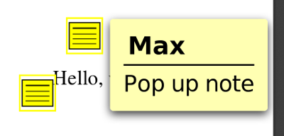

#### Parameters:
The parameters must be wrapped within a dictionary (cfg. [Backward Compatibility](#backwardCompatibility)).

| Paramater   |     Type      |  Description |
|----------|-------------|------|
| page |  number | The page number where the annotation must be added (starting with 0)|
| rect  |   number array   |   Rectangle defining the coordinates \[x, y\] to place the annotation. It is also possible to specify \[x_1, y_1, x_2, y_2 \] to define the bounds of the annotation. |
| contents | string |  The annotation text ('Pop up note' in the example) |
| author | string |    The author name. ('Max' in the example) |
| color | object |   (*Optional*) Of type `{ r : <r>, g : <g>, b : <b> }`. Values can be either in the range (0 - 255) or (0 - 1). Specifies the color of the annotation.|
| open | boolean | (*Optional*) If true, the annotation is opened by default; default value is *false*|
| icon  | enum | (*Optional*) {*AnnotationIcon.Comment, AnnotationIcon.Key, AnnotationIcon.Note, AnnotationIcon.Help, AnnotationIcon.NewParagraph,  AnnotationIcon.Paragraph,  AnnotationIcon.Insert*}  control the displayed icon. default is *note* |
| state | enum | (*Optional*) {*AnnotationState.Marked, AnnotationState.Unmarked, AnnotationState.Accepted, AnnotationState.Rejected, AnnotationState.Cancelled, AnnotationState.Completed, AnnotationState.None*}  Controls the state of the annotation|
| stateModel | enum | (*Optional*) {*AnnotationStateModel.Marked, AnnotationStateModel.Review*} The state model. This option is linked to the *state*. For state model *Marked* the **only** legal state options are *Marked* and *Unmarked*. The other state options are only legal for the *Review* state model.|

Note that there are more optional parameters available, as described in [Configuration Options](#configurationOptions). Also note, that a text annotation is a **Markup** annotation.

In *evince* the annotation icons ar displayed as follows:

|  |  |  |  |  |  |
|-------------------------|----------------------------|---------------|---------------|---------------|-------------|
| AnnationIcon.Help | AnnotationIcon.Insert | AnnotationIcon.Key | AnnotationIcon.NewParagraph | AnnotationIcon.Paragraph | AnnotationIcon.Note |

When using the default appearance stream, the icons look as follows:


|  |  |
|-----------------------------------------------------------------------------------|-----------------------------------------------------------------------------------|
| AnnationIcon.Help                                                                 | AnnotationIcon.Note                                                               |

Note that currently only the icons *Help* and *Note* are supported. If you need other icons you can either adapt the appearance stream or create a feature request.

Example usage:

```
import { AnnotationFactory, AnnotationIcon } from 'annotpdf';

AnnotationFactory.loadFile(path).then((factory) => {
        factory.createTextAnnotation({
                page: 0,
                rect: [50, 50, 80, 80],
                contents: "Pop up note",
                author: "Max",
                color: {r: 128, g: 128, b: 128},
                open: false,
                icon: AnnotationIcon.Help,
                opacity: 0.5
        })
})
```

### <a name="createhighlight"></a>createHighlightAnnotation(...)
The highlight annotation emphasizes a selected text, with a semitransparent color.

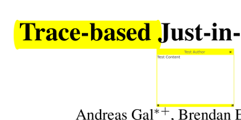

#### Parameters:
| Paramater   |     Type      |  Description |
|----------|-------------|------|
| page |  number | The page number where the annotation must be added (starting with 0)|
| rect  |   number array   |   Rectangle defining the size and the position of the annotation. The format is \[x_1, y_1, x_2, y_2 \], what defines the upper left and the lower right corner of the rectangle.  If you specify the quadPoints array you can also hand over an empty list. The library takes the convex hull of your quadpoint definitions. |
| contents | string |  The annotation text  |
| author | string |    The author name.  |
| color | object |   Of type `{ r : <r>, g : <g>, b : <b> }`. Values can be either in the range (0 - 255) or (0 - 1). Specifies the color of the annotation.|
| quadPoints | number array | Optional argument for specifying the quadpoints of the annotation (cfg. [Quadpoints](#QuadPoints) ). |

Note that there are more optional parameters available, as described in [Configuration Options](#configurationOptions). Also note, that a text annotation is a **Markup** annotation.

Example usage:

```
import { AnnotationFactory } from 'annotpdf';

AnnotationFactory.loadFile(path).then((factory) => {
        factory.createHighlightAnnotation({
                page: 0,
                rect: [100, 100, 200, 200],
                contents: "Test123",
                author: "John",
                color: {r: 128, g: 128, b: 128},
                opacity: 0.5
        })
})
```

### <a name="createunderline"></a>createUnderlineAnnotation(...)
The underline annotation underlines a selected text. However, see the remark: This annotation is not always correctly rendered.

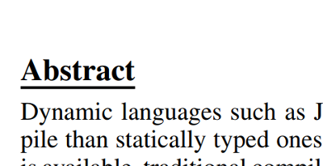

#### Parameters:
| Paramater   |     Type      |  Description |
|----------|-------------|------|
| page |  number | The page number where the annotation must be added  (starting with 0)|
| rect  |   number array   |   Rectangle defining the size and the position of the annotation. The format is \[x_1, y_1, x_2, y_2 \], what defines the upper left and the lower right corner of the rectangle.  If you specify the quadPoints array you can also hand over an empty list. The library takes the convex hull of your quadpoint definitions. |
| contents | string |  The annotation text  |
| author | string |    The author name.  |
| color | object |   Of type `{ r : <r>, g : <g>, b : <b> }`. Values can be either in the range (0 - 255) or (0 - 1). Specifies the color of the annotation.|
| quadPoints | number array | Optional argument for specifying the quadpoints of the annotation (cfg. [Quadpoints](#QuadPoints) ). |

Note that there are more optional parameters available, as described in [Configuration Options](#configurationOptions). Also note, that a text annotation is a **Markup** annotation.

**Note** The underline annotation is not displayed by the PDFjs renderer. However, it is displayed in the chrome PDF viewer. Sometimes it is wrongly rendered. In the Ubuntu Gnome PDF viewer *Evince* it is displayed as *overline*. Use the `createDefaultAppearanceStream()` option to support all PDF renderers.

Example usage:

```
import { AnnotationFactory } from 'annotpdf';

AnnotationFactory.loadFile(path).then((factory) => {
        factory.createUnderlineAnnotation({
                page: 0,
                rect: [100, 100, 200, 200],
                contents: "Test123",
                author: "John",
                color: {r: 128, g: 128, b: 128},
                opacity: 0.5
        })
})
```


### <a name="createsquiggly"></a>createSquigglyAnnotation(...)

Uses a curly line for underlining a selected text.

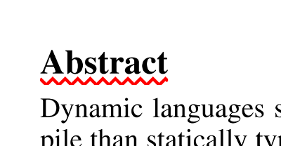

#### Parameters:
| Paramater   |     Type      |  Description |
|----------|-------------|------|
| page |  number | The page number where the annotation must be added (starting with 0)|
| rect  |   number array   |   Rectangle defining the size and the position of the annotation. The format is \[x_1, y_1, x_2, y_2 \], what defines the upper left and the lower right corner of the rectangle.  If you specify the quadPoints array you can also hand over an empty list. The library takes the convex hull of your quadpoint definitions. |
| contents | string |  The annotation text  |
| author | string |    The author name.  |
| color | object |   Of type `{ r : <r>, g : <g>, b : <b> }`. Values can be either in the range (0 - 255) or (0 - 1). Specifies the color of the annotation.|
| quadPoints | number array | Optional argument for specifying the quadpoints of the annotation (cfg. [Quadpoints](#QuadPoints) ). |

Note that there are more optional parameters available, as described in [Configuration Options](#configurationOptions). Also note, that a text annotation is a **Markup** annotation.

Example usage:

```
import { AnnotationFactory } from 'annotpdf';

AnnotationFactory.loadFile(path).then((factory) => {
        factory.createSquigglyAnnotation({
                page: 0,
                rect: [100, 100, 200, 200],
                contents: "Test123",
                author: "John",
                color: {r: 128, g: 128, b: 128},
                opacity: 0.5
        })
})
```

### <a name="createstrikeout"></a>createStrikeOutAnnotation(...)

Can be used to cross out the selected text.

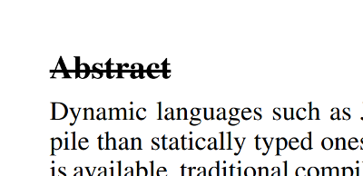

#### Parameters:
| Paramater   |     Type      |  Description |
|----------|-------------|------|
| page |  number | The page number where the annotation must be added (starting with 0)|
| rect  |   number array   |   Rectangle defining the size and the position of the annotation. The format is \[x_1, y_1, x_2, y_2 \], what defines the upper left and the lower right corner of the rectangle. If you specify the quadPoints array you can also hand over an empty list. The library takes the convex hull of your quadpoint definitions. |
| contents | string |  The annotation text  |
| author | string |    The author name.  |
| color | object |   Of type `{ r : <r>, g : <g>, b : <b> }`. Values can be either in the range (0 - 255) or (0 - 1). Specifies the color of the annotation.|
| quadPoints | number array | Optional argument for specifying the quadpoints of the annotation (cfg. [Quadpoints](#QuadPoints) ). |

Note that there are more optional parameters available, as described in [Configuration Options](#configurationOptions). Also note, that a text annotation is a **Markup** annotation.

Example usage:

```
import { AnnotationFactory } from 'annotpdf';

AnnotationFactory.loadFile(path).then((factory) => {
        factory.createStrikeOutAnnotation({
                page: 0,
                rect: [100, 100, 200, 200],
                contents: "Test123",
                author: "John",
                color: {r: 128, g: 128, b: 128},
                opacity: 0.5
        })
})
```

### <a name="createfreetext"></a>createFreeTextAnnotation(...)

Creates a free text annotations. It puts a label at an arbitrary position. Notice that in particular the chrome PDF viewer and the Firefox PDF viewer are only able to render the annotation when using a default appearance stream.

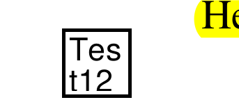

#### Parameters:
| Paramater         | Type         | Description                                                                                                                                                                                                                                                                                                                                                                                                                        |
|-------------------|--------------|------------------------------------------------------------------------------------------------------------------------------------------------------------------------------------------------------------------------------------------------------------------------------------------------------------------------------------------------------------------------------------------------------------------------------------|
| page              | number       | The page number where the annotation must be added (starting with 0)                                                                                                                                                                                                                                                                                                                                                               |
| rect              | number array | Rectangle defining the size and the position of the annotation. The format is \[x_1, y_1, x_2, y_2 \], what defines the upper left and the lower right corner of the text annotation.                                                                                                                                                                                                                                              |
| contents          | string       | The annotation text                                                                                                                                                                                                                                                                                                                                                                                                                |
| author            | string       | The author name.                                                                                                                                                                                                                                                                                                                                                                                                                   |
| color             | object       | Of type `{ r : <r>, g : <g>, b : <b> }`. Values can be either in the range (0 - 255) or (0 - 1). Specifies the color of the annotation.                                                                                                                                                                                                                                                                                            |
| textColor         | object       | Of type `{ r : <r>, g : <g>, b : <b> }`. Values can be either in the range (0 - 255) or (0 - 1). Specifies the color of the annotation.                                                                                                                                                                                                                                                                                            |
| textJustification | enum         | (Optional) Justification of the text. {TextJustification.Left, TextJustification.Centered, TextJustification.Right}. Defaults to 'Left'                                                                                                                                                                                                                                                                                            |
| freetextType      | enum         | (Optional) Type of the freetext annotation. {FreeTextType.FreeText, FreeTextType.FreeTextCallout, FreeTextType.TypeWriter}. Defaults to FreeText. Note that the options are **not** available in most PDF viewers. A callout type annotation adds a pointer to an annotation. The TypeWriter type allows the user to insert data into the annotation, as a text box. See the image below for an example of the callout annotation. |
| calloutLine       | number array | (Optional) Max four numbers representing pivot points of the callout line. This option only applies in case the callout type is selected.                                                                                                                                                                                                                                                                                          |
| lineEndingStyle   | enum         | (Optional) Type of the line ending of the callout pointer. \{LineEndingStyle.Square, LineEndingStyle.Circle, LineEndingStyle.Diamond, LineEndingStyle.OpenArrow, LineEndingStyile.ClosedArrow, LineEndingStyle.None, LineEndingStyle.Butt, LineEndingStyle.ROpenArrow, LineEndingStyle.RClosedArrow, LineEndingStyle.Slash\}. See images below for more information.                                                               |
| font              | string/Font  | (Optional) Specify a font. Either use a font from the document. [getFonts()](#getFonts) for more information. Or use one of the PDF standard fonts: Times-Roman, Times-Bold, Times-Italic, Times-BoldItalic, Helvetica, Helvetica-Bold, Helvetica-Oblique, Helvetica-BoldOblique, Courier, Courier-Oblique, Courier-Bold, Courier-BoldOblique, Symbol, ZapfDingbats. If no font is selected, Helvetica will be used.               |
| fontSize          | number       | (Optional) Specify the font size in *pt*. Default is *18pt*                                                                                                                                                                                                                                                                                                                                                                        |

Example of a callout annotation:

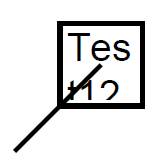

Line ending styles of callout pointers:

| 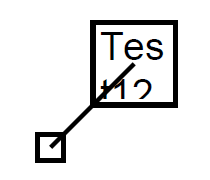 | 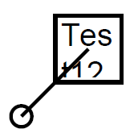 | 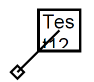 | 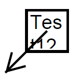 | 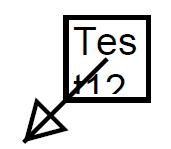 | 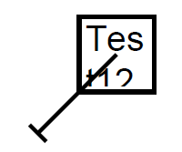 | 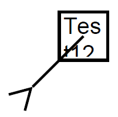 | 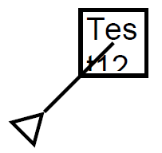 | 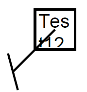 |
|---------------------------------------------------------|--------------------------------------------------------|------------------------------------------------------------|--------------------------------------------------------------------|------------------------------------------------------------------------|--------------------------------------------------|----------------------------------------------------------------------|----------------------------------------------------------------------------|-----------------------------------------------------|
| Square                                                  | Circle                                                 | Diamond                                                    | OpenArrow                                                          | ClosedArrow                                                            | Butt                                             | ROpenArrow                                                           | RClosedArrow                                                               | Slash                                               |

Please note, that if you use the `createDefaultAppearanceStream()` method, the library will apply a naive line wrapping to place the text in the space defined by the `rect` field. It tries to split at spaces and only if the space is not sufficient to hold a single word it will wrap the line within a word. If the defined rect is not sufficient to display the whole text it will be cut off at the bottom. The text starts at the upper right corner. You can format the text by specifying the `rect` and playing with the `fontSize`. Also note, that the default appearance stream does not support callout lines. If you need those, please create a feature request.

### <a name="createline"></a>createLineAnnotation(...)
Not yet implemented.

### <a name="createcircle"></a>createCircleAnnotation(...)

Adds a circle annotation to the document.

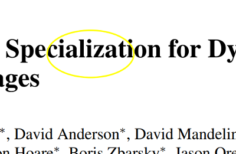

#### Parameters:
| Paramater | Type         | Description                                                                                                                                        |
|-----------|--------------|----------------------------------------------------------------------------------------------------------------------------------------------------|
| page      | number       | The page number where the annotation must be added (starting with 0)                                                                               |
| rect      | number array | The format is \[x_1, y_1, x_2, y_2 \], what defines the upper left and the lower right corner of the circle.                                       |
| contents  | string       | The annotation text                                                                                                                                |
| author    | string       | The author name.                                                                                                                                   |
| color     | object       | Of type `{ r : <r>, g : <g>, b : <b> }`. Values can be either in the range (0 - 255) or (0 - 1). Specifies the color of the annotation.            |
| fill      | object       | Of type `{ r : <r>, g : <g>, b : <b> }`. Values can be either in the range (0 - 255) or (0 - 1). Specifies the background color of the annotation. |

### <a name="createsquare"></a>createSquareAnnotation(...)

Adds a square annotation to the document.

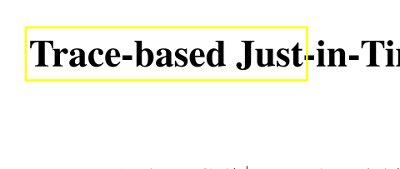

#### Parameters:
| Paramater | Type         | Description                                                                                                                                        |
|-----------|--------------|----------------------------------------------------------------------------------------------------------------------------------------------------|
| page      | number       | The page number where the annotation must be added (starting with 0)                                                                               |
| rect      | number array | The format is \[x_1, y_1, x_2, y_2 \], what defines the upper left and the lower right corner of the square.                                       |
| contents  | string       | The annotation text                                                                                                                                |
| author    | string       | The author name.                                                                                                                                   |
| color     | object       | Of type `{ r : <r>, g : <g>, b : <b> }`. Values can be either in the range (0 - 255) or (0 - 1). Specifies the color of the annotation.            |
| fill      | object       | Of type `{ r : <r>, g : <g>, b : <b> }`. Values can be either in the range (0 - 255) or (0 - 1). Specifies the background color of the annotation. |

### <a name="createpolygon"></a>createPolygonAnnotation(...)

Adds a polygon as depicted in the following figure.

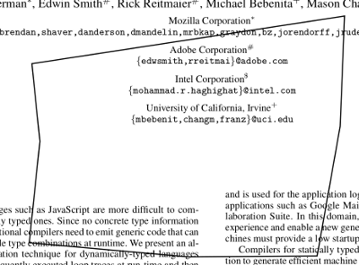

#### Parameters:
| Paramater   |     Type      |  Description |
|----------|-------------|------|
| page |  number | The page number where the annotation must be added (starting with 0)|
| rect  |   number array   |   The format is \[x_1, y_1, x_2, y_2 \], what defines the upper left and the lower right corner of the square. |
| contents | string |  The annotation text  |
| author | string |    The author name.  |
| vertices | number array |    \[x_1, y_1, ... , x_n, y_n\] the points building the polygon. |
| color | object |   Of type `{ r : <r>, g : <g>, b : <b> }`. Values can be either in the range (0 - 255) or (0 - 1). Specifies the color of the annotation.|
| fill      | object       | Of type `{ r : <r>, g : <g>, b : <b> }`. Values can be either in the range (0 - 255) or (0 - 1). Specifies the background color of the annotation. |

### <a name="createpolyline"></a>createPolyLineAnnotation(...)

Adds a polygon line as depicted in the following figure.

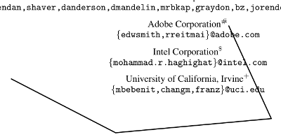

#### Parameters:
| Paramater        | Type         |                                                                                                                                                                                                                                        Description |
|------------------|--------------|---------------------------------------------------------------------------------------------------------------------------------------------------------------------------------------------------------------------------------------------------:|
| page             | number       |                                                                                                                                                                               The page number where the annotation must be added (starting with 0) |
| rect             | number array |                                                                                                                                       The format is \[x_1, y_1, x_2, y_2 \], what defines the upper left and the lower right corner of the square. |
| contents         | string       |                                                                                                                                                                                                                                The annotation text |
| author           | string       |                                                                                                                                                                                                                                   The author name. |
| vertices         | number array |                                                                                                                                                                                      \[x_1, y_1, ... , x_n, y_n\] the points building the polygon. |
| color            | object       |                                                                                                            Of type `{ r : <r>, g : <g>, b : <b> }`. Values can be either in the range (0 - 255) or (0 - 1). Specifies the color of the annotation. |
| lineEndingStyles | enum array   | (Optional) See line ending styles in FreeTextAnnotation documentation parts. Provide an array of to line ending styles for the start and the end of the polyline object. Please note that these option is not supported by numerous PDF renderers. |

### <a name="createstamp"></a>createStampAnnotation(...)
Not yet implemented.

### <a name="createcaret"></a>createCaretAnnotation(...)
Not yet implemented.

### <a name="createink"></a>createInkAnnotation(...)
Adds an ink annotation

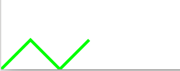

#### Parameters:
| Paramater   |     Type      |  Description |
|----------|-------------|------|
| page |  number | The page number where the annotation must be added (starting with 0)|
| rect  |   number array   |   The format is \[x_1, y_1, x_2, y_2 \], what defines the upper left and the lower right corner of the square. |
| contents | string |  The annotation text  |
| author | string |    The author name.  |
| inkList | array of number arrays |    \[x_1, y_1, ... , x_n, y_n\] the points specifying the line to draw. When providing multiple lists multiple lines will be drawn. It is also possible to porvide only a single list of numbers. The API will translate this into a list of a list of numbers.  |
| color | object |   Of type `{ r : <r>, g : <g>, b : <b> }`. Values can be either in the range (0 - 255) or (0 - 1). Specifies the color of the annotation.|

### <a name="createpopup"></a>createPopupAnnotation(...)
Not yet implemented.

### <a name="deleteAnnotation"></a>deleteAnnotation(...)
Deletes an existing annotation. Either from the set of newly created annotations or from the actual PDF document.

#### Parameters:
| Paramater   |     Type      |  Description |
|----------|-------------|------|
| id |  string or object | Either the unique ID string or *object_id* object.|

### <a name="getAnnotations"></a>getAnnotations()

Returns the annotations that originally exist in the PDF document and those that were created by the library in the mean time. The return values is a list of lists, where every list represents one page in the pdf document.

### <a name="getFonts"></a>getFonts()

Returns the fonts, that are defined in the PDF document.

### <a name="write"></a>write(...)

Appends the created annotations to the PDF file and returns the complete file encoded as *UInt8Array*.

### <a name="download"></a>download(...)

The download method allows the download of the adapted PDF document in the browser.

#### Parameters:
| Paramater   |     Type      |  Description |
|----------|-------------|------|
| fileName | string |  Specify a file name of the download file. By default it is called 'output.pdf'. |

### <a name="save"></a>save(...)

The save method allows to store the adapted PDF document in a **nodejs** environment.

**Please notice**: It seems to be unusal to create a library targeting the node environment and the browser equally. When using the library in *Angular 6+* it complains that the module **fs** can not be loaded. For more information see discussion on [Github](https://github.com/angular/angular-cli/issues/10681). I did not find a way to compile this library or change the code of the library sothat it is possible to run it in angular and nodejs. If you know please contact me.

If you want to use this method you need to uncomment it in the code. Sorry for the inconvenience. I know this is a really, really poor design;).

#### Parameters:
| Paramater   |     Type      |  Description |
|----------|-------------|------|
| fileName | string |  Specify a file name of the file. By default it is called 'output.pdf'. |

# <a name="HowWorks"></a>How does the Library Works? -- Head Jump into the Rabbit Hole

## <a name="Trivia"></a>Trivia

The annotation of PDF documents is an awesome feature that I really appreciate. Although there exists a number of javascript PDF viewer libraries, as for instance *pdfjs*, those do not support the creation of annotations. There exists the library [pdf-annotate.js](https://github.com/instructure/pdf-annotate.js/) an interesting annotation solution that introduces an additional layer for creating annotations on top of the PDF document. For storing these annotations a storage adapter must be provided. Instead of storing the annotations separated from the actual PDF document file I prefer storing the annotations directly in the PDF file. Otherwise these annotations are only visible in dedicated viewer application.

I started the journey by diving into the pdfjs library. I managed to create annotations that are visible on the viewing area, but noticed a bit late that pdfjs does not provide any sort of pdf writer. So it is only one step to extend the pdfjs library by an annotation that is correctly positioned with all the styles applied, but an entirely different step to write these information into a valid PDF document.

So I tried to employ different javascript pdf writer libraries, as *pdfkit*, *pdfmake* or *jspdf*, to create a new PDF document by going through the pdfjs PDF datastructure and write all the objects of the PDF document into the datastructures of the writer libraries. Since my plan was to use this functionality in a browser within the angular framework I failed in using pdfkit and pdfmake. *jspdf* on the other hand seemed to work. The only problem was that it was not able to parse CFF based fonts and after diving a few days into the opentype font specification and some implementations that were able to convert CFF fonts into TTF outlined fonts I decided that there must be a simpler way. Additionally I figured that the font problem would not be the last problem, when trying to clone a PDF document from a more highlevel datastruture. A PDF document can comprise a lot of different data.

Finally I stumbled over the **Updating** section in the PDF specification. Generally speaking it is possible to add annotations by just appending them to the end of the PDF file. Furthermore it is possible to delete or edit existing annotations. I decided that this might be the best way to implement the annotation of PDF documents in a javascript context.

## <a name="AddingAnnotation"></a>Adding an Annotation

In the following I describe the function of the library on a high level. We assume that the PDF document was loaded entirely and the data stream is available.

**Procedure:**
1. An annotation is created
2. The latest update of **Page** object must be fetched to check, whether there exists an **Annots** field in the object definition
3. If there is no **Annots** field it must be added and a reference to a list must be added that holds the references to the annotations of the page
4. We need to append one or two new object to the PDF document: One object that represents the newly created annotation and if necessary one object representing the list of annotations of a page, in case the corresponding page does not have an **Annots** field yet.
5. For this we need unique object identifiers (see [PDF Objects](#PDFObjects)). There are two ways to identify *new* object numbers in a PDF document. Either by using an existing but freed object identifier or by creating a new one by incrementing the last used object identfier.
6. After adding the objects and updating the **Annots** array the cross reference table must be created and attached to the file data
7. Finally we need some way to download or process the modified file

We can conclude: for creating an annotation we need the following informations:
- a free object id (new or reused) for creating the annotation object
- the address of the annotation field or to the page object, if the annotation field does not exists yet. In this case we also need a free object id for the new annotation list
- the last update section for handling the references and the cross reference table

From [Document updates](#DocumentUpdates) we learned that we can use the cross reference table for efficiently reading the necessary objects and information from PDF documents.

### <a name="DocumentUpdates"></a>Document Updates

A newly created PDF document closes with three sections: *Body update*, *Cross-reference section* and *Updated Trailer*. When the PDF document is updated, that means manipulated by for instance adding an annotation, another triplet of a *Body update*, *Cross-reference section* and *Updated Trailer* is attached to the end of the file. These sections contain jump addresses that allow an efficient traversal through the PDF document. So by reading the last update section we can go backwards and read all the information without the need of consuming outdated (already updated) information.

To understand how such an update section works let us consider the following example:

```
7 0 obj [6 0 R 8 0 R ] endobj
8 0 obj <</Type /Annot /Rect [77.7777777778 83.7931904161 83.7777777778 89.7856242119 ] /Subtype /Text /M (D:20190101154225) /T (max) /Contents (Pop up note) /NM (okular) /F 4 /C [1 1 0 ] /CA 1 /Border [0 0 1 ] /P 3 0 R >> endobj
xref
0 1
0000000001 65535 f
7 2
0000001321 00000 n
0000001352 00000 n
trailer
<</Size 9 /Root 1 0 R /Prev 1150 >>
startxref
1648
%%EOF
```

The first part contains the body update. In this example the objects *7* and *8* are updated. Thereby the object *7* represents the list of annotations of a certain page. This list is extended by another new annotation defined in object *8*.

The next part starting with the *xref* keyword represents the *cross-reference section*. The cross-reference section can be devided into sub sections that are always separated by the two numbers, which are again separated by a blank. So in the example, we have two subsections one starting with **0 1** and one starting with **7 2**. The first number represents the object id of the first referenced object and the second the number of references contained in subsection. So in the subsection starting with **7 2** we know that the first entry refers to the object with id *7* and has two entries. The second entry refers to an object with id **8**.

If there is a gap in the consecutive enumeration of updated objects a new subsection is created that starts with the id of the first updated object in a consecutive row of updated objects. In this way uninvolved objects must not be mentioned in the table.

Let us now consider the structure of the subsection entries. It starts with a pointer to the object locations. So for instance in the entrie **0000001321 00000 n** the number 0...01321 represents the number of the byte in the document where the object with id *7* is defined. The second number in this case **00000** represents the *generation* number of the object. That is an indication of how often the corresponding object id was reused. An object can be freed. The object id becomes available again and can be reused. To mark an object id that had been reused the generation number is used. (see [PDF Objects](#PDFObjects) for more information). The third part of a subsection entry is an **n** or an **f**. **f** marks an object as freed, that means its object id can be reused, while **n** indicates the creation of a new object or the update of an existing object.

There is an additional particularity when freeing an object: The first number in the subsection entry represents then the address of the last free object. So we build a linked list of freed objects. This also explains the existance of the entry with object id **0**, which represents the head of the linked list of freed entries. **65535** represents the maximum generation number. The generation number of a freed object is the generation number of the object that is newly created and reuses the object id.

The last part of the update section contains the file trailer. It starts with the keyword trailer and is followed by the trailer dictionary. The trailer dictionary has commonly three sections: The **Root** key refers to the catalog dictionary object of the PDF document, the **Prev** key points to the previous cross reference section. This entry does not exists in the first document trailer, which marks the start of the document update history. The **Size** key contains the total number of entries in the cross-reference table with respect to the complete update history. So for instance in the example we have a size of *9*, which means that the complete cross-reference table (covering the total history) has 8 objects. In the body update section we created the object with id *8*, thus together with the 0'th object we have *9* objects maintained by the table. This number will always increment when using a new object id. It can also be used to easily identify the newest object id.

The last part of the trailer starts with the keyword **startxref** and the position of the **xref** keyword. This represents the byte poisiton of the cross reference table start.

### <a name="PDFObjects"></a>PDF Objects

A PDF document consists of an arbitrary number of objects. These objects have different purposes. A page object is the logic representation of a physical PDF page, a root object is the start position of the document top-down traversal, there are also content objects, and a great variety of other types.

What all these objects have in common is how they are identified and referenced. An object reference consists of a number representing an **object id** and a **generation**. An exemplary object definition is given in the following:

```
3 0 obj
...
endobj
```

Here the object has id *3* and generation *0*. So what is this generation value? The PDF specification allows the reusing of object ids. If there was once an object with id *3*, but then it was freed, its id can be reused at the next update as a unique id for a new object. To differentiate the original object and the object that uses the reused id there exists the *generation* field. It is incremented for every reuse of the id.

When referencing an object we need to provide the object id, as well as the generation to unambiguously identify a certain object. To reference the introduced example object we write:
```
3 0 R
```

### <a name="CrossReferenceStreamObjects"></a>Cross-Reference Stream Objects

Since the introduction of PDF 1.5 there exists apart from the cross-reference tables the feature to compress the reference information using *cross-reference stream objects*. Basically these are regular PDF stream objects consisting of a dictionary containing
information about the structure of the stream and at the end of the object a stream section holding the compressed reference table.

An example is given in the following:

```
3680 0 obj <<
/Type /XRef
/Index [0 3681]
/Size 3681
/W [1 3 1]
/Root 3678 0 R
/Info 3679 0 R
/ID [<4E4CF7709370170501AFF281926C390D> <4E4CF7709370170501AFF281926C390D>]
/Length 8605
/Filter /FlateDecode
>>
stream
...
endstream
endobj
```

Note that a cross-refeerence stream object must have the type `/XRef`. In this example the actual stream is replaced by `...`, since this is only a bytestream and cannot be displayed in character encodings anyway.

In general the stream data is compressed. The used compressing algorithm is determined by the attribute `/Filter`. Before one can work with the stream data it is necessary to uncompress them. We will discuss compression
algorithms later, but assume in the following that we already have an uncompressed data stream. See the [Compression](#Compression) section for more information.

The most important information provided by the cross-reference stream object to interprete the stream data is given by the `/W` attribute. It determines the length of a cross-reference entry. In this case the value of
`/W` is `[1 3 1]`, what means that the total length of a cross-reference entry is `5` bytes. It further determines that the first value is encoded using one byte, the second value with three bytes and the last value
again with one byte.

So in this case a cross-reference entry is determined by three values. Note that it is posisble that a field becomes *0*, in which case it is omitted, since `0` bytes are used to represent it.

The meaning of the three values is explained in the PDF standard. The first value determines the type. A `0` as value means that a freed object is encoded, a `1` determines a regular object and a `2` a compressed one.

**Type 0**: For understanding freed objects, please read [Document Updates](#DocumentUpdates). The three bytes of a freed object encode the object id of the next freed object and the third value represents the generation to use
when reusing the freed object. This establishes a linked list of freed object ids, as we already discussed in  [Document Updates](#DocumentUpdates).

```
00000000 00000000 00000000 00000000 00000000
|-Type-| |-------first value------| |2. value|
```

**Type 1**: Those types are regular cross-reference objects, as we already know from the regular cross-reference tables. In this case the three byte value represents the pointer start position of the PDF object in the document.

**Type 3**: This type is introduced with stream objects (cf. [Stream Objects](#StreamObjects)). Besides the option to compress the cross-reference table it is now possible to compress PDF objects in general. In this case multiple objects are encoded in a stream object.
In this case the three byte value determines the object id of the stream object that contains the actual object. The third value determines an offset. In a stream objects multiple objects are encoded sequentiell in the object stream.
The offset determines the position of the object in the stream.

Note that the **object id** is not directly encoded in the cross reference stream. That is similar to the concept of section headers in the cross-reference tables. If no `/Index` field is available, the cross-reference stream object
is considered as one long cross-reference section, with the first encoded cross-reference entry representing the object with id *0*, the second entry the object with id *1* and so on.

The `/Index` attribute determines the length of such a sequence. In this case it says `[0 3681]` what means starting at object id *0* the stream section encodes *3681* objects. Which is also stated in the `/Size` field. However,
as in the case of cross-reference tables multiple incoherent sequences can be encoded.

```
/Index [0 4 10 2]
```
This for example can be interpreted that the tream first encodes four objects starting with id *0* (so objects with ids: 0, 1, 2 and 3) and two objects starting with id *10* (so objects with ids: 10 and 11).

Note that as in case of cross-reference tables there might be mulitple cross-reference stream objects that build upon each other. In this case a stream object contains a `/Prev` attribute that points to the previous object.

### <a name="StreamObjects"></a>Stream Objects

The non-stream part of a stream object represents a dictionary containing information about the structure of the stream data. The `/Type` attribute of a stream object is always `/ObjStm`. The number of encoded objects is
given by the `/N` attribute and the first attribute starts at the value given by the `/First` attribute.

```
3488 0 obj <<
/Type /ObjStm
/N 100
/First 1021
/Length 6246
/Filter /FlateDecode
>>
stream
...
endstream
endobj
```

The reason for providing a `/First` attribute is that the stream consist of two parts. The firs part can be considered as a cross reference table for the objects within the stream object, while the second part contains the actual
object data.

Two important remarks about the structure of the stream:

* All **generation** values of objects within a stream object are **0**. That means objects with reused object ids can not be compressed into stream objects.
* The `obj` and `endobj` key words for determining the limits of an object are omitted within the stream.

As in case of [Cross-Reference Stream Objects](#CrossReferenceStreamObjects) the data stream is compressed. We assume in the following that we already deal with an uncompressed data stream. See the [Compression](#Compression) section for more information.

The first part of a cross reference stream object determines the position of encoded objects within the stream.

Every entry consists of two values: the *object id* and an *offset*.

So a the object data of an object with id $i$ can be found at position $\textit{/First} + \textit{offset}_{i}$.

### <a name="Compression"></a>Compression

The compression of a stream object is determined by two flags: `/Filter` and `/DecodeParms`. The first determines the actual compression algorithm. In the example above it is the Flate decoding, which is right now the only supported
encoding. If this becomes a problem, please file a feature request.

The optional decode parameters determine additional filtering of the stream data. So for instance it is possible to apply the PNG predictor functions to improve the actual compression. When uncompressing a stream data it is then necessary
to invert the predictor values.
h
